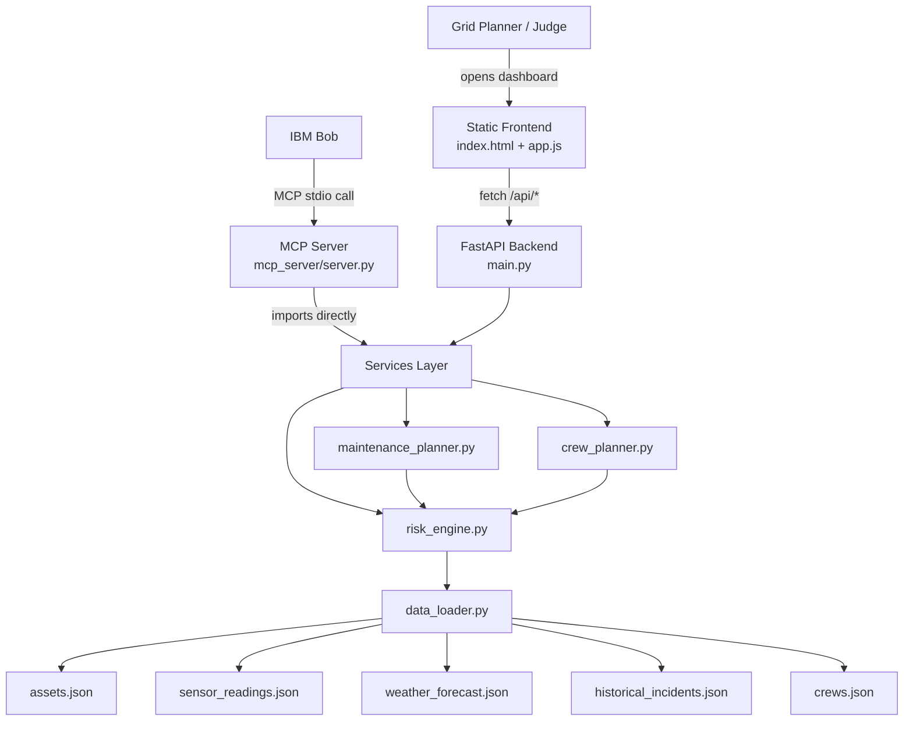

# Architecture

## Diagram

## Component table

| Component | Technology | Responsibility |
|---|---|---|
| Frontend dashboard | Static HTML/CSS/JS + Chart.js (CDN) | Renders risk chart/table, maintenance plan, crew plan by calling the REST API |
| Backend API | FastAPI (Python) | Exposes `/api/assets`, `/api/risk/ranking`, `/api/weather/forecast`, `/api/maintenance/plan`, `/api/crew/plan` |
| Risk engine | Pure Python service module | Fuses sensor, weather, and historical signals into a ranked, explainable risk score |
| Maintenance planner | Pure Python service module | Converts the risk ranking into prioritised, actionable maintenance tasks |
| Crew planner | Pure Python service module | Assigns/pre-positions crews to at-risk regions ahead of forecasted weather |
| MCP server | `mcp` Python SDK (FastMCP) | Exposes the same services as tools IBM Bob can call live, over stdio |
| Data layer | JSON fixture files | Stand in for real SCADA/IoT sensor feeds, a weather API, and an incident database |
| Tests | pytest | Verifies risk ordering, sensor normalisation, and plan generation logic |

## Data flow, end to end

1. `data_loader.py` reads the five JSON fixtures once (cached) and exposes
   typed accessor functions — this is the seam where real sensor/weather/
   incident APIs would be plugged in without touching any service code.
2. `risk_engine.py` calls those accessors per asset, normalises each raw
   sensor reading against engineering thresholds, scores weather and
   historical risk per region, and combines all three into a composite
   score and a grid-impact-severity ranking.
3. `maintenance_planner.py` and `crew_planner.py` both consume
   `get_ranked_risk_assessment()` and add their own domain logic (recommended
   action per worst sensor signal; crew-to-region assignment with
   availability/specialty matching).
4. The FastAPI routers in `app/routers/` are thin wrappers that call these
   services and return JSON — no business logic lives in the routers.
5. The MCP server in `app/mcp_server/server.py` imports and calls the exact
   same service functions, so IBM Bob is querying live, identical logic,
   not a separate summary.
6. The frontend fetches from the same-origin `/api/*` routes (the FastAPI
   app also serves the static frontend files) and renders three views: risk
   overview, maintenance plan, and crew plan.

## Security & scalability notes

- The JSON data layer is intentionally isolated behind `data_loader.py` so
  it can be swapped for a real time-series database (e.g. TimescaleDB for
  sensor history) or a live weather API without changing `risk_engine.py`,
  `maintenance_planner.py`, or `crew_planner.py`.
- CORS is currently open (`allow_origins=["*"]`) for ease of local judging;
  in production this would be restricted to the deployed frontend origin.
- The MCP server runs as a separate process over stdio, so it can be
  sandboxed or given a reduced permission set independently of the main API
  process.
- Risk engine weights are environment-configurable
  (`WEIGHT_SENSOR_HEALTH`, `WEIGHT_WEATHER_RISK`, `WEIGHT_HISTORICAL_RISK`)
  so operators can retune the model per-region without a code change or
  redeploy.
